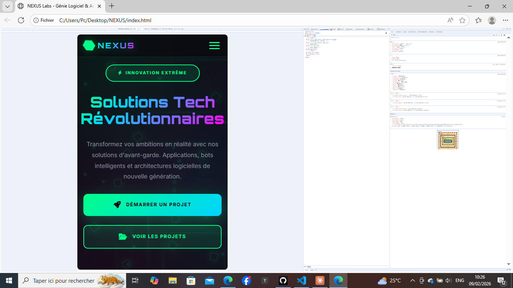
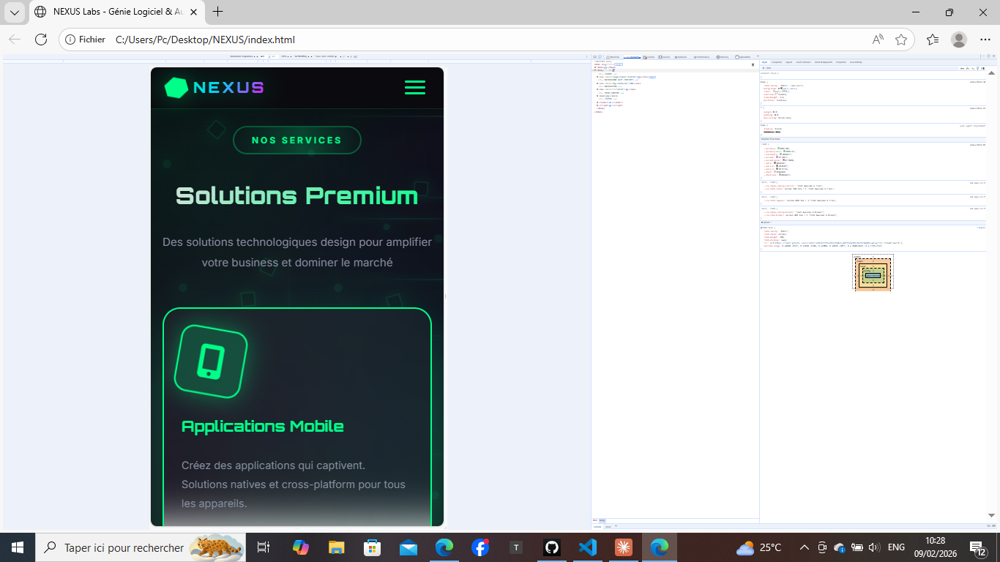
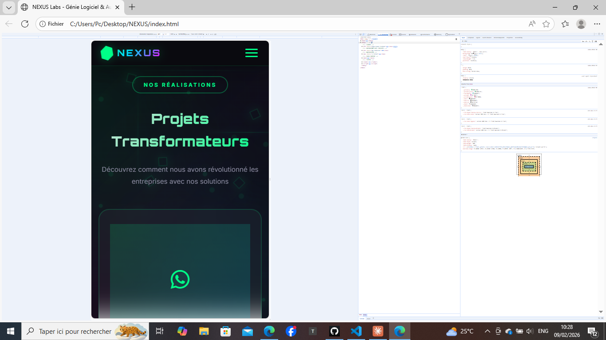
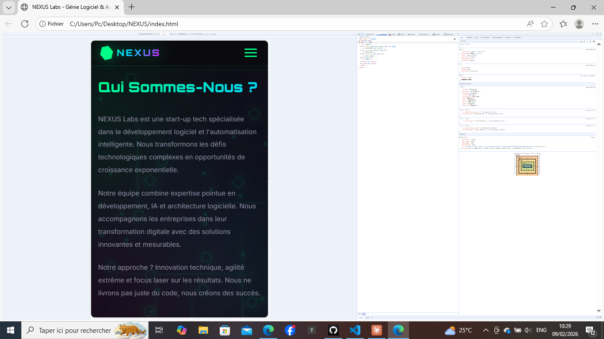
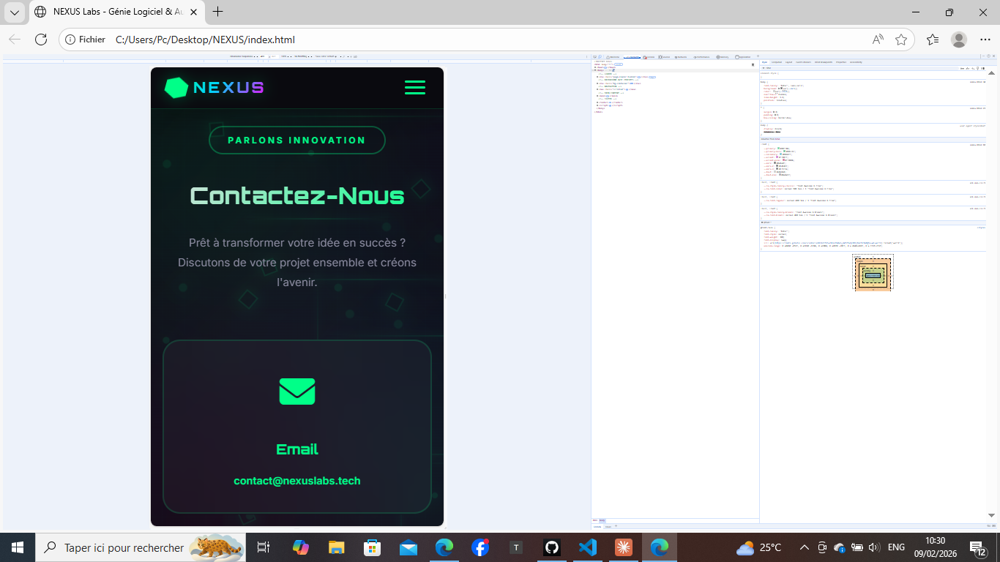
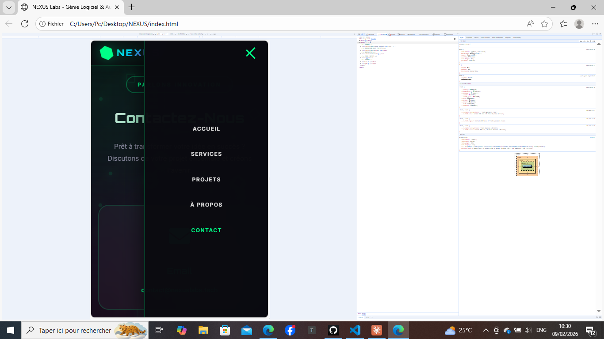

# 🚀 NEXUS LABS

> ✨ **Transforming Ideas Into Digital Excellence** ✨

---

## 📊 Overview

**NEXUS Labs** est une plateforme ultra-moderne conçue pour révolutionner votre approche du développement digital. Nous combinons innovation, créativité et expertise technique pour créer des solutions exceptionnelles.

### 🎯 Mission
Transformer vos idées les plus audacieuses en réalité numérique, en fournissant des services de qualité mondiale avec une touche personnalisée.

---

## ✨ Caractéristiques Principales

```
┌─────────────────────────────────────────┐
│  🌟 Design Ultra-Moderne & Responsif    │
│  🎨 Interface Intuitive & Fluide         │
│  ⚡ Performance Optimale                 │
│  🔐 Code Sécurisé & Maintenable        │
│  📱 Compatible Tous Appareils           │
│  🎭 Animations Subtiles & Élégantes     │
└─────────────────────────────────────────┘
```

---

## 🛠️ Technologies Utilisées

| Frontend | Backend | Tools |
|----------|---------|-------|
| **HTML5** | Node.js | Git |
| **CSS3** | Express | GitHub |
| **JavaScript** | MongoDB | VS Code |

**Typography:** Space Grotesk | Fira Code | Inter

**Color Palette:** 
- 🟢 Neon Green: `#00ff88`
- 🔵 Cyan: `#00d4ff`
- 🎀 Pink: `#ff006b`
- ⚫ Dark: `#050508`

---

## 📸 Galerie du Projet

### Page d'Accueil


### Services


### Portfolio & Projets


### À Propos


### Contact


### Navigation


---

## 🎨 Design Highlights

### ✅ Responsivité
- ✨ Desktop (1024px+)
- 📱 Tablet (768px - 1023px)
- 📲 Mobile (< 768px)

### 🎙️ Animations
- Smooth scroll navigation
- Hover effects subtles
- Fade-in revelations au scroll
- Gradient glows minimalistes

### 🌈 Palette Fluorescente
```css
Primary:     #00ff88  /* Neon Green */
Secondary:   #00d4ff  /* Cyan */
Accent:      #ff006b  /* Pink */
Background:  #050508  /* Pure Black */
Text:        #f5f5f7  /* White-ish */
```

---

## 🚀 Sections Principales

### 1️⃣ **Hero Section**
Layout grid moderne avec code display animé

### 2️⃣ **Services**
4 cartes de services avec hover effects

### 3️⃣ **Portfolio**
6 projets showcasés avec images

### 4️⃣ **À Propos**
Statistiques + stack technologique

### 5️⃣ **Contact**
3 canaux (Email, WhatsApp, Telegram)

---

## 📧 Contact & Socials

```
📧 Email:    developpeurgithub@gmail.com
💬 WhatsApp: +237 620 251 962
🚀 Telegram: @nexuslabstech
```

---

## 🎯 Objectifs

- ✅ Attirer une clientèle premium
- ✅ Démontrer expertise & créativité
- ✅ Portfolio impactant
- ✅ Conversion optimale vers contact

---

## 📝 Licence

Ce projet est privé et protégé. Tous droits réservés © 2026 NEXUS Labs

---

<div align="center">

### 🌟 **Merci de votre intérêt pour NEXUS Labs!** 🌟

*Où l'innovation rencontre l'excellence*

**[📱 Visitez le site](c:\Users\Pc\Desktop\NEXUS\index.html)** | **[📧 Contactez-nous](mailto:developpeurgithub@gmail.com)**

</div>

# NEXUS
