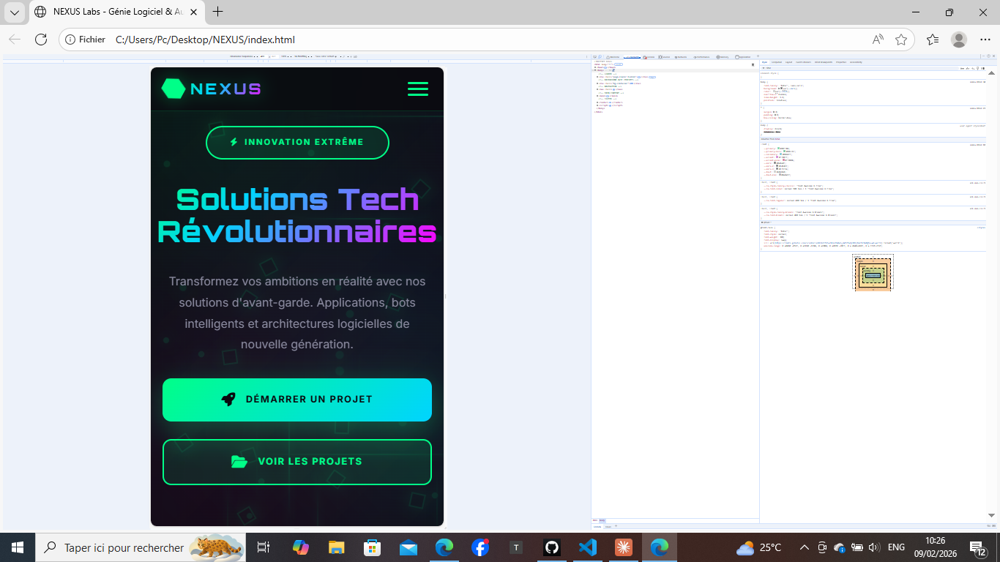
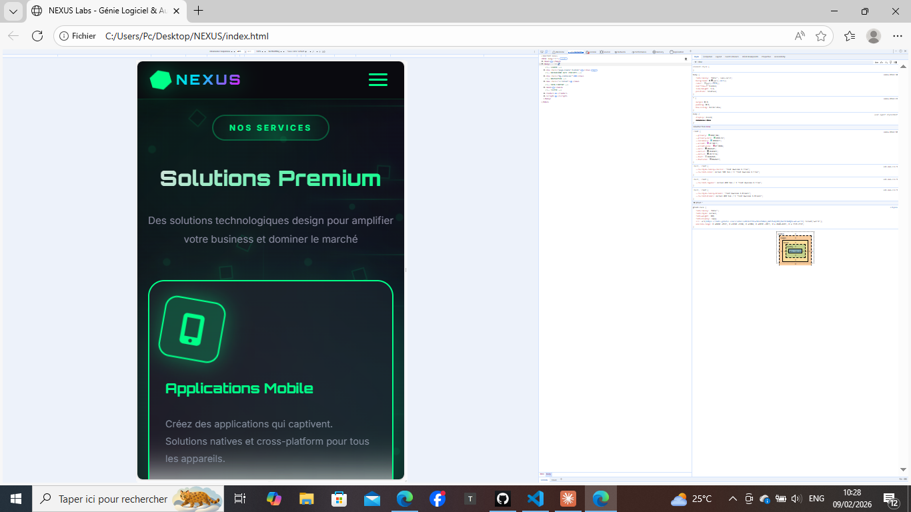
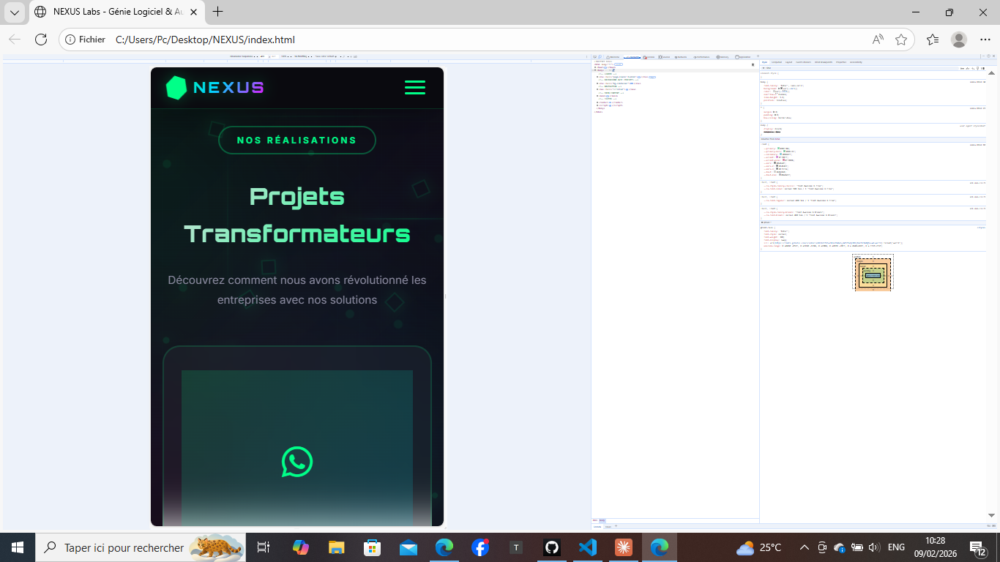
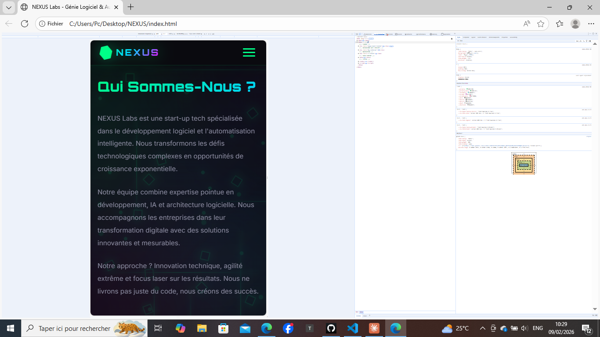
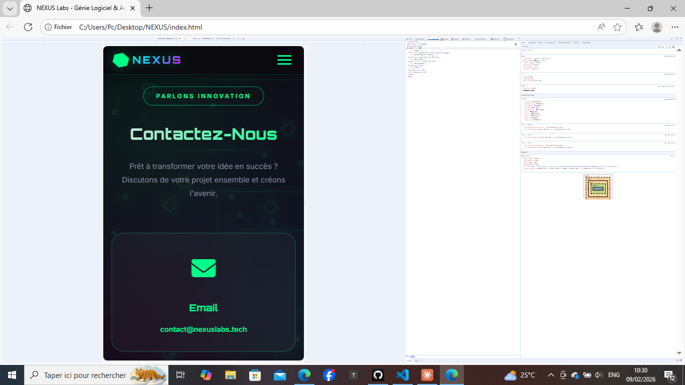
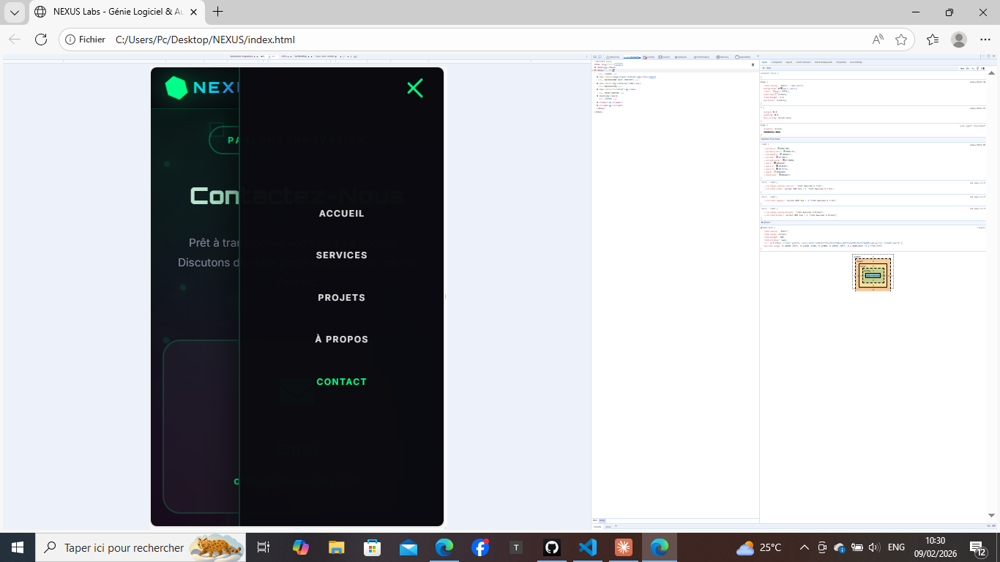

#  NEXUS LABS

>  **Transforming Ideas Into Digital Excellence** 

---

##  Overview

**NEXUS Labs** est une plateforme ultra-moderne conçue pour révolutionner votre approche du développement digital. Nous combinons innovation, créativité et expertise technique pour créer des solutions exceptionnelles.

###  Mission

Transformer vos idées les plus audacieuses en réalité numérique, en fournissant des services de qualité mondiale avec une touche personnalisée.

---

##  Caractéristiques Principales

-  **Design Ultra-Moderne & Responsif** : Une expérience visuelle premium sur tous les écrans.
-  **Interface Intuitive & Fluide** : Navigation pensée pour l'utilisateur.
-  **Performance Optimale** : Chargement rapide et exécution sans faille.
-  **Code Sécurisé & Maintenable** : Architecture robuste suivant les meilleures pratiques.
-  **Compatible Tous Appareils** : Fonctionne parfaitement de l'ordinateur de bureau au smartphone.
-  **Animations Subtiles & Élégantes** : Des transitions qui donnent vie à votre projet.

---

##  Technologies Utilisées

### Stack Principal

| Domaine | Technologies |
|---------|-------------|
| **Frontend** | HTML5, CSS3, JavaScript |
| **Backend** | Node.js, Express |
| **Bases de Données** | MongoDB |
| **Outils** | Git, GitHub, VS Code |

### Design System

- **Typographie :** Space Grotesk | Fira Code | Inter
- **Palette de Couleurs :**
  -  **Neon Green:** `#00ff88`
  -  **Cyan:** `#00d4ff`
  -  **Pink:** `#ff006b`
  -  **Dark / Background:** `#050508`
  -  **Text:** `#f5f5f7`

---

##  Galerie du Projet

### Page d'Accueil

### Services

### Portfolio & Projets

### À Propos

### Contact

### Navigation

---

##  Design Highlights

###  Responsivité

-  **Desktop** (1024px et +)
-  **Tablet** (768px - 1023px)
-  **Mobile** (Moins de 768px)

###  Animations

- Navigation avec *smooth scroll*
- Effets de survol (*hover*) subtils
- Révélations en fondu (*fade-in*) lors du défilement
- Lueur dégradée (*gradient glows*) minimaliste

---

##  Sections Principales de l'Application

1.  **Hero Section** : Layout grid moderne avec un affichage de code animé.
2.  **Services** : 4 cartes de services interactives avec des effets de survol.
3.  **Portfolio** : Showcase de 6 projets avec galeries d'images.
4.  **À Propos** : Mise en avant des statistiques et de la stack technologique.
5.  **Contact** : 3 canaux de communication directs (Email, WhatsApp, Telegram).

---

##  Objectifs du Projet

-  Attirer une clientèle premium.
-  Démontrer notre expertise technique et notre créativité.
-  Proposer un portfolio impactant et mémorable.
-  Optimiser le taux de conversion vers la prise de contact.

---

##  Contact & Réseaux

Restons connectés ! N'hésitez pas à nous contacter pour toute opportunité ou collaboration.

-  **Email :** [developpeurgithub@gmail.com](mailto:developpeurgithub@gmail.com)
-  **WhatsApp :** [+237 620 251 962](https://wa.me/237620251962)
-  **Telegram :** [@nexuslabstech](https://t.me/nexuslabstech)

---

##  Licence

Ce projet est **privé et protégé**. Tous droits réservés © 2026 NEXUS Labs.

---

###  Merci de votre intérêt pour NEXUS Labs ! 

*Où l'innovation rencontre l'excellence.*

**[🌐 Visiter le Site Web](./index.html)** | **[📬 Nous Contacter](mailto:developpeurgithub@gmail.com)**

